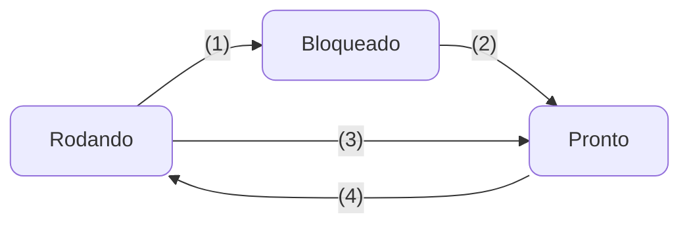

# 3. Processos
O controle de um ambiente multiprogramável é de resposabilidade exclusiva do sistema operacional. Para isso, a execução de uma aplicação sempre deve estar associada a um **processo**, estes são a base para a construção de sistema multiprogramável.

## 3.1 Mas afinal, o que é um processo?
Um processo nada mais é que a instância de um programa em execução. Ele é a unidade básica de um sistema operacional. Cada processo possui seu próprio contador de programa, pilha, variáveis, ponteiro para a pilha, e assim por diante. O conjunto dessas informações pode ser entendida como o **contexto do processo**. Essa definição ressalta a diferença entre programa e processo.

### 3.1.1 Programa ou Processo?
Um programa é um conjunto de instruções **passivas** em disco/arquivos, já o processo, é a instância ativa de um programa em execução na memória. Cada processo possui **seu próprio contexto**, isso implica que dois processos do mesmo programa podem ser diferentes. Em analogia, um programa seria como uma receita de um bolo, e o processo seria a execução de fato do bolo.

## 3.2 Estrutura de um processo
Segundo Machado e Maia[^1], processos podem ser divididos em 3 partes: Contexto de Hardware, Contexto de Software e Espaço de endereçamento.

[^1]: Machado, F. B.; Maia, L. P. Arquitetura de Sistemas Operacionais. 5. ed. Rio de Janeiro: LTC, 27 junho 2017.

### 3.2.1 Contexto de Hardware
É o conteúdo dos registradores gerais e específicos da CPU durante a execução do processo. No momento que o processo perde o acesso à CPU, o sistema salva o seu contexto.
### 3.2.2 Contexto de Software 
Nele são especificados os limites e características dos recursos que podem ser alocados pelo processo, número máximo de arquivos, tamanho do buffer de I/O, prioridade de execução, etc. Essas informações podem ser divididas em: **Identificação, Quotas e Privilégios**.
### 3.2.3 Espaço de endereçamento
Faz referência a região de memória pertencente àquele processo, cada processo têm a sua própria.

## 3.3 Estados de um processo
Um processo pode passar por 3 estados diferentes devido a eventos ocasionados pelo sistema operacional ou pelo processo, são eles:
### 3.3.1 Rodando (running)
Um processo é dito "rodando" quando está efetivamente sendo executado pela CPU. Em sistemas com apenas 1 processador, apenas 1 processo pode ser executado em 1 unidade de tempo.
### 3.3.2 Bloqueado (wait)
Um processo está bloqueado quando aguarda por algum recurso externo ou alguma informação para seguir processando. Como por exemplo uma leitura de disco ou uma entrada do usuário.
### 3.3.3 Pronto (ready)
Um processo que está pronto é aquele que aguarda apenas pelo seu processamento na CPU. O sistema operacional é responsável pela ordem e pelos critérios pelos quais os processos podem fazer uso do processador. Este mecanismo é chamado de *Escalonamento*.

<div align="center">


</div>

> Legenda: 
> 
>   - (1): O processo bloqueia-se aguardando uma entrada
>   - (2): O evento aguardado pelo processo ocorreu, pode-se iniciar a executar.
>   - (3): O tempo de posse do processador esgotou-se
>   - (4): O processo é escolhido pelo escalonador para executar

## 3.4 Classficação de processos
Processo podem ser classificados em **CPU-bound** ou **I/O-bound**. O primeiro tipo, são aqueles que têm afinidade à CPU, ou seja, irão passar a maior parte do tempo em execução(running) ou pronto. Já os I/O-bound (afinidade à Entrada/Saída) passam a maior parte do tempo bloqueados esperando a ação do usuário. Muitas aplicações que rodam em primeiro plano são I/O-bound.

## 3.5 Bloco de controle de processos (PCB)
Todas as informações sobre um processo *(contexto de hardware, contexto de software e espaço de endereçamento)* são armazenadas em um tabela. Os PCBs de todos os processos ficam em uma área exclusiva do SO na memória principal. O tamanho dessa área, geralmente, delimitida o número máximo de processos suportados simultaneamente pelo sistema.

Para visualizar a tabela:
```bash
ps aux
```

## 3.6 Processos independentes, Subprocessos e Threads
Processos independentes, subprocessos e threads são formas de implementar a concorrência em uma aplicação. Consiste em subdividir o programa em partes que possam trabalhar juntas.

O uso de **processos independentes** é a forma mais simples de implementar a concorrência. Não há vínculo entre o processo criador e o criado. A criação de um processo exige a alocação de uma PCB com contexto de hardware, software e espaço de endereçamento.

**Subprocessos** são criados de maneira hierárquica, onde o *processo-pai* e o *processo-filho* podem compartilhar informações e são dependentes entre si, ou seja, se um *pai* for eliminado seus filhos também serão. Uma característica desses tipos é o consumo de recursos e tempo de CPU para alocação e eliminação dos processos, além do problema da comunicação e sincronização dos processos pouco eficientes, visto que cada um possui seu próprio espaço de endereçamento.

**[Threads](../notes/05_thread.md)** surgem em alternativa a esses dois modelos  , como uma tentativa de diminuir os custos de criação, eliminação e troca de contexto. Cada processo pode ter várias threads, e a elas compartilham a CPU da mesma maneira que os processos (enquanto uma espera a outra executa). Cada thread possui seu **próprio contexto de hardware**, entretanto ==compartilham o mesmo contexto de software e espaço de endereçamento entre si==. Isso permite uma comunicação entre thread ==mais simples e rápida==.

> Processos podem ser classficados quanto ao custo da [troca de contexto](../notes/04_gerencia_do_processador.md#troca-contexto) e de manutenção.

> - Heavyweight: Processos tradicionais.
> - Lightweight: [Threads](../notes/05_thread.md).    
    