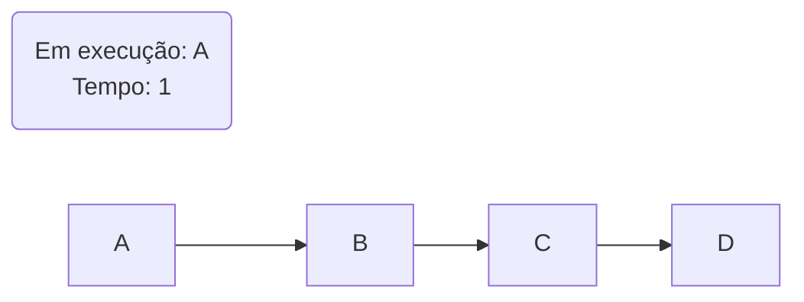
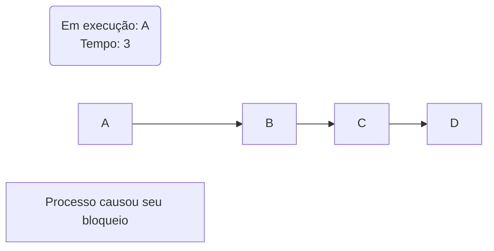
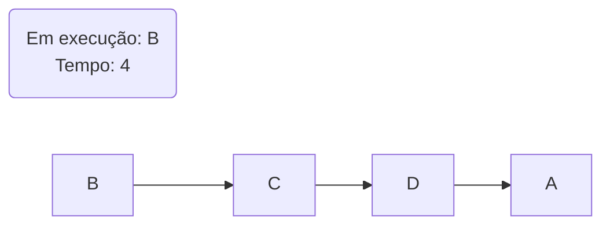
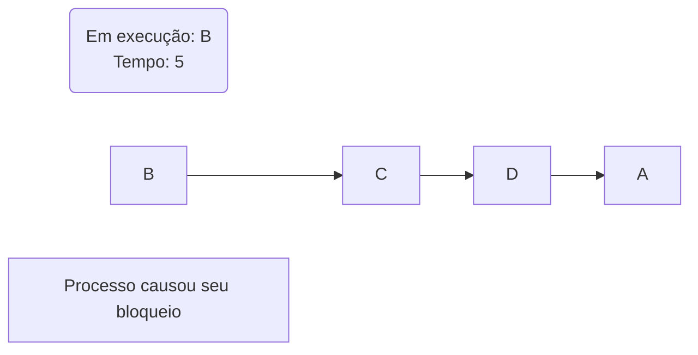

# 4. Gerência do processador

Com o surgimento dos [sistemas multiprogramáveis](../notes/01_conceitos_basicos.md#122-sistemas-multiprogramaveis), onde vários processos podem permanecer na memória principal, enquanto são executados de maneira concorrente, a gerência do processador se tornou uma das principais atividades de um SO. Quando múltiplos processos encontram-se no [estado de pronto](../notes/03_processos_e_threads.md#333-pronto-ready), é necessário eleger um para ser executado pela CPU, esta atividade é conhecida como **Escalonamento de Processador**. A parte do sistema operacional responsável por essa ação é o **Escalonador**. 

## 4.1 Escalonador e critérios de escalonamento
Um escalonador bem projeto deve garantir alguns fatores como: maximização de desempenho, melhor aproveitamento da CPU, privilegiar processos críticos, maximizar o throughput, entre outros. Isso, claro, se adequa à cada sistema operacional e seus diferentes propósitos. Para garantir que estes fatores sejam atendidos da melhor maneira temos os chamados **critérios de escalonamento**:

!!! info "Critérios de Escalonamento"
    - **Justiça**: Garantir que todos os processos tenham chances *justas* de uso da CPU. Não são chances iguais.
    - **Eficiência**: O processador deve ficar o mínimo de tempo possível em *ociosidade* e maximizando a utilização dos recursos.
    - **Responsividade**: Reduzir o tempo de resposta dos processos interativos, podemos entender como o intervalo de tempo entre a última tecla digitada pelo usuário até o início da exibição do resultado na tela. Geralmente não depende da capacidade de processamento, mas sim dos dispositivos de I/O. (Não contabiliza tempo total de execução).
    - **Tempo de espera**: Esse critério visa minimizar o tempo na fila de espera (quando processo está em estado de pronto).
    - **Tempo de turnaround**: Reduzir o tempo desde o lançamento do processo até seu término. Isso envolve tempo de espera por operações de I/O, alocação de memória, processamento e tempo de espera. Mais utilizado em [processamento batch](../notes/01_conceitos_basicos.md#1221-sistemas-batch-processamento-em-lote).
    - **Throughput**: Maximizar o número de tarefa executadas em uma unidade de tempo.  

    !!! failure 
        > Não é possível atingir todos estes critérios, muitos deles são conflitantes entre si.

### 4.1.1 Escalonadores Preemptivos e Não-Preemptivos
Escalonadores podem ser classificados em duas categorias principais: preemptivos e não-preemptivos. A diferença fundamental entre eles é capacidade de interromper um processo em execução ou não. Preempção é a suspensão temporária da execução de um processo.

1. **Escalonador não-preemptivo**: Assim que um processo entra em execução, ele irá até o fim ou até que ele peça alguma operação que cause seu bloqueio, como uma operação de I/O, por exemplo. ==O escalonador ou nenhuma outra entidade externa é capaz de tirar o processo da CPU "à força". São de projeto simples, porém permitem o abuso de tempo da CPU. Sendo assim um processo pode monopolizar a CPU, ferindo diversos critérios de escalonamento==.

2. **Escalonador preemptivo**: Nesse tipo de escalonador, cada processo possui uma *time-slice* de uso do processador. Quando este tempo chega ao fim o sistema operacional retira a CPU deste processo e permite que outro processo execute. ==Estes escalonadores asseguram um uso balanceado do processador, e são utilizados na maioria dos SOs modernos. Apesar das vantagens, o projeto de tais escalonadores é uma tarefa bastante complexa e traz complicações na programação do processamento concorrente==.

## 4.2 Algoritmos de escalonamento
Então surge o problema: Dado um conjunto de processos, como dividir o uso do processador entre eles?

### 4.2.1 First Come First Served
Também conhecido como escalonamento First-In-First-Out(FIFO), o algoritmo *FCFS scheduling* prioriza quem chega primeiro, ou seja, o processo que primeiro pedir a CPU é o primeiro a obter a CPU. Este algoritmo é **não-preemptivo**, processos que são [CPU-bound](../notes/03_processos_e_threads.md#34-classficacao-de-processos) podem fazer que com outros processos esperem por tempo indeterminado. A implementação deste algoritmo usa uma fila de processos.

<center>


---


---



---



---



---


</center>

!!! success "Vantagens"
    - Simples de ser implementado.
    - Eficiente: a **CPU** sempre está em uso.

!!! failure "Desvantagens"
    - Imprevisibilidade: nunca se sabe quando um processo irá iniciar.
    - Tempo de espera médio entre os processo não é priorizado.
    - Processo [CPU-bound](../notes/03_processos_e_threads.md#34-classficacao-de-processos) levam vantagem em vista dos [I/O-bound](../notes/03_processos_e_threads.md#34-classficacao-de-processos).

<!-- ```mermaid
%%{init: { "themeVariables": {"xyChart": {"plotColorPalette": "#ff0000"} } }}%%
xychart-beta horizontal
    title "Média de tempo em Escalonamento FIFO"
    x-axis ["Processo A", "Processo B", "Processo C"]
    y-axis "Tempo Médio"
    bar [0, 10]
```
 -->