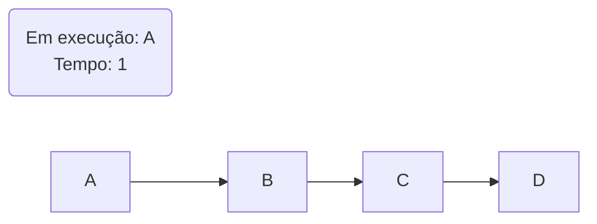
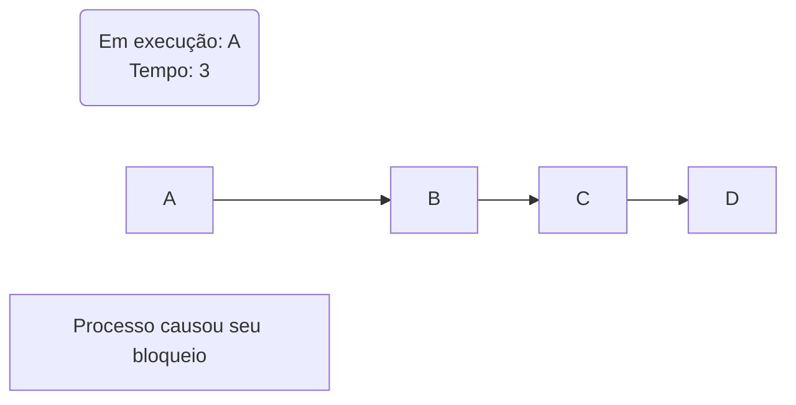
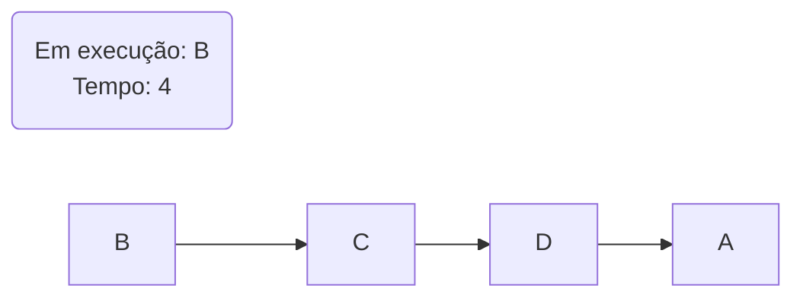
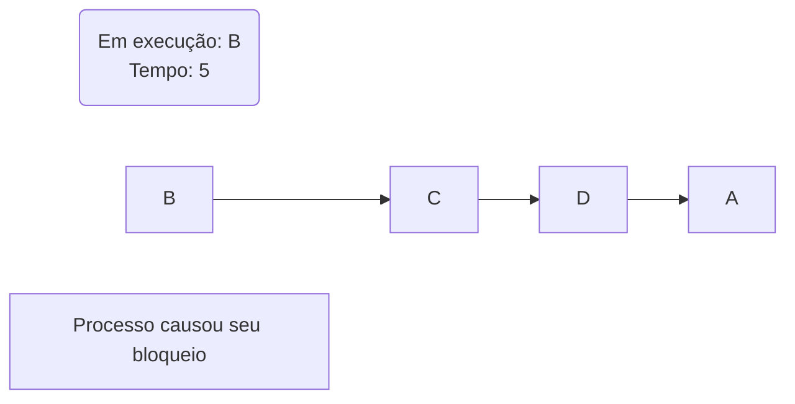

# 4. Gerência do processador

Com o surgimento dos [sistemas multiprogramáveis](../notes/01_conceitos_basicos.md#122-sistemas-multiprogramaveis), onde vários processos podem permanecer na memória principal, enquanto são executados de maneira concorrente, a gerência do processador se tornou uma das principais atividades de um SO. Quando múltiplos processos encontram-se no [estado de pronto](../notes/03_processos_e_threads.md#333-pronto-ready), é necessário eleger um para ser executado pela CPU, esta atividade é conhecida como **Escalonamento de Processador**. A parte do sistema operacional responsável por essa ação é o **Escalonador**. 

## 4.1 Escalonador e critérios de escalonamento
Um escalonador bem projetado deve garantir alguns fatores como: maximização de desempenho, melhor aproveitamento da CPU, privilegiar processos críticos, maximizar o throughput, entre outros. Isso, claro, se adequa à cada sistema operacional e seus diferentes propósitos. Para garantir que estes fatores sejam atendidos da melhor maneira temos os chamados **critérios de escalonamento**:

!!! info "Critérios de Escalonamento"
    - **Justiça**: Garantir que todos os processos tenham chances *justas* de uso da CPU. Não são chances iguais.
    - **Eficiência**: O processador deve ficar o mínimo de tempo possível em *ociosidade* e maximizando a utilização dos recursos.
    - **Responsividade**: Reduzir o tempo de resposta dos processos interativos, podemos entender como o intervalo de tempo entre a última tecla digitada pelo usuário até o início da exibição do resultado na tela. Geralmente não depende da capacidade de processamento, mas sim dos dispositivos de I/O. (Não contabiliza tempo total de execução).
    - **Tempo de espera**: Esse critério visa minimizar o tempo na fila de espera (quando processo está em estado de pronto).
    - **Tempo de turnaround**: Reduzir o tempo desde o lançamento do processo até seu término. Isso envolve tempo de espera por operações de I/O, alocação de memória, processamento e tempo de espera. Mais utilizado em [processamento batch](../notes/01_conceitos_basicos.md#1221-sistemas-batch-processamento-em-lote).
    - **Throughput**: Maximizar o número de tarefa executadas em uma unidade de tempo.  

    !!! warning "Observação:"
        Não é possível atingir todos estes critérios, muitos deles são conflitantes entre si.

### 4.1.1 Escalonadores Preemptivos e Não-Preemptivos
Escalonadores podem ser classificados em duas categorias principais: preemptivos e não-preemptivos. A diferença fundamental entre eles é capacidade de interromper um processo em execução ou não. Preempção é a suspensão temporária da execução de um processo.

1. **Escalonador não-preemptivo**: Assim que um processo entra em execução, ele irá até o fim ou até que ele peça alguma operação que cause seu bloqueio, como uma operação de I/O, por exemplo. ==O escalonador ou nenhuma outra entidade externa é capaz de tirar o processo da CPU "à força". São de projeto simples, porém permitem o abuso de tempo da CPU. Sendo assim um processo pode monopolizar a CPU, ferindo diversos critérios de escalonamento==.

2. **Escalonador preemptivo**: Nesse tipo de escalonador, cada processo possui uma *time-slice* de uso do processador. Quando este tempo chega ao fim o sistema operacional retira a CPU deste processo e permite que outro processo execute. ==Estes escalonadores asseguram um uso balanceado do processador, e são utilizados na maioria dos SOs modernos. Apesar das vantagens, o projeto de tais escalonadores é uma tarefa bastante complexa e traz complicações na programação do processamento concorrente==.

## 4.2 Algoritmos de escalonamento
Então surge o problema: Dado um conjunto de processos, como dividir o uso do processador entre eles?

<a id="troca-contexto"></a>
!!! note "Troca de contexto" 
    Antes de definir os algoritmos é importante entender o que é **"Troca de contexto"**. É um procedimento no qual o sistema operacional salva o estado de um processo em execução ([contexto de hardware](../notes/03_processos_e_threads.md#321-contexto-de-hardware)), e carrega o estado de outro a ser executado. Esse mecanismo é essencial para multitarefa e permite que o sistema operacional gerencie a execução de múltiplos processos, garantindo que cada um tenha acesso à CPU de maneira ordenada e eficiente.


### 4.2.1 First Come First Served
Também conhecido como escalonamento First-In-First-Out(FIFO), o algoritmo *FCFS scheduling* prioriza quem chega primeiro, ou seja, o processo que primeiro pedir a CPU é o primeiro a obter a CPU. Este algoritmo é **não-preemptivo**, processos que são [CPU-bound](../notes/03_processos_e_threads.md#34-classficacao-de-processos) podem fazer que com outros processos esperem por tempo indeterminado. A implementação deste algoritmo usa uma fila de processos.

<center>


---


---



---



---



---


</center>

> **Problema**: Dados o tempo de chegada e tempo de execução. Calcule o tempo de espera, tempo de serviço e tempo médio de espera.

- Tempo de espera = Tempo de serviço - Tempo de chegada

| Processo | Tempo de chegada | Tempo de execução | Tempo de serviço | Tempo de espera |
| -------- | :--------------: | :---------------: | :--------------: | :-------------: |
| A        |        0         |        10         |        0         |        0        |
| B        |        1         |         4         |        10        |        9        |
| C        |        2         |         3         |        14        |       12        |

- Tempo médio de espera = (0 + 9 + 12) / 3 = 7

Note que se invertermos a ordem de chegada dos processos:

| Processo | Tempo de chegada | Tempo de execução | Tempo de serviço | Tempo de espera |
| -------- | :--------------: | :---------------: | :--------------: | :-------------: |
| B        |        0         |         4         |        0         |        0        |
| C        |        1         |         3         |        4         |        3        |
| A        |        2         |        10         |        7         |        5        |

- Tempo médio de espera = (0 + 3 + 5) / 3 = 2.66

Uma diferença significativa.

!!! success "Vantagens"
    - Simples de ser implementado.
    - Eficiente: a **CPU** sempre está em uso.

!!! failure "Desvantagens"
    - Imprevisibilidade: nunca se sabe quando um processo irá iniciar.
    - Tempo de espera médio entre os processo não é priorizado.
    - Processo [CPU-bound](../notes/03_processos_e_threads.md#34-classficacao-de-processos) levam vantagem em vista dos [I/O-bound](../notes/03_processos_e_threads.md#34-classficacao-de-processos).
 
### 4.2.2 Round-Robin (Escalonamento circular)
Neste tipo de algoritmo, cada processo tem o direito de usar o processador por uma fatia determinada de tempo. Esta fatia pode ser denominada ***quantum***. Assim que o quantum termina o processador é disponibilizado para outro processo. O escalonamento circular é **preemptivo**, projetado principalmente para [sistemas de tempo compartilhado](../notes/01_conceitos_basicos.md#1222-sistemas-de-tempo-compartilhado-time-sharing). Ele se assemelha muito ao FCFS, porém com essa limitação de tempo na CPU.

Um dos maiores problemas deste tipo de escalonamento é a definição de um quantum adequado. Para determinar este tempo deve se considera o tempo de [troca de contexto](../notes/04_gerencia_do_processador.md#troca-contexto) e o tempo de resposta desejado. 

> Qual a influência que o tempo da troca de contexto?  
Bom, se a troca de contexto levar um tempo muito maior que o quantum, os processos ficarão mais tempo sendo trocados do que efetivamente em execução, o que não faz sentido algum. Para um algoritmo eficiente o **tempo de troca de contexto**, deve ser deve ser consideravelmente menor que o tempo de execução

- Um quantum padrão seria de 100ms. 
- Um quantum muito longo seria equivalente à um FCFS.
- Um quantum muito curto perderia muito requisitos, tais como a eficiência.

!!! success "Vantagens"
    - Justiça: Processos recebem tempo igual de execução.
    - Simplicidade de implementação.
    - Responsividade.
    - Prevenção de inanição: Nenhum processo morre "faminto".

!!! failure "Desvantagens"
    - Sobreposição de troca de contexto: Troca constante pode levar a uma sobrecarga (quantum curto).
    - Sensibilidade ao quantum: Escolha da fatia de tempo é crucial.
    - Desempenho para processos longos pode ser muito ruim.
    - Latência para processos de alta prioridades: Não leva prioridade em conta.

<details>
<summary>Escalonador Round-Robin:</summary>
```C
--8<-- "exec/lista_1/escalonador-round-robin.c"
```
</details>


### 4.2.3 Escalonadomento por Prioridades
É um algoritmo no qual os processos são selecionados com base em sua prioridade. Baseia-se no fato de alguns processos são mais prioritários e, portanto, devem ser executados primeiro. Este é um escalonador **preemptivo**, porém não existe um tempo determinado que um processo pode executar. Ele irá rodar até que ele mesmo cause seu bloqueio ou até que um processo de maior prioridade fique pronto. Processos com igual prioridade são selecionados por ordem de chegada.Para cada processo é atribuída uma prioridade que pode ser **Estática** ou **Dinâmica**.

1. **Prioridade Estática**: Para cada processo é atribuída uma classe/valor, onde cada classe possui sua fila de prontos. ==A prioridade não é alterada durante a existência do processo==.
2. **Prioridade Dinâmica**: A prioridade pode ser ajustada de acordo com critérios definidos pelo sistema operacional. ==Permite ajustar o escalonamento em função do comportamento de cada processo==.

!!! success "Vantagens"
    - Flexibilidade.
    - Adaptabilidade: Principalmente devido à prioridade dinâmica.

!!! failure "Desvantagens"
    - Inanição: Este é o principal problema deste tipo de algoritmo. Processos de baixa prioridade podem permanecer indefinidamente na fila de pronto. Uma possível solução é o *aging*, onde, na prioridade dinâmica, a prioridade dos processos é incrementa em função do tempo.
    - Injustiça: Processos de alta prioridade podem monopolizar a CPU.
    - Complexidade relativamente alta.

### 4.2.4 Shortest Job First (SJF)
Projetado para [sistemas batch](../notes/01_conceitos_basicos.md#1221-sistemas-batch-processamento-em-lote), este algoritmo seleciona o processo com menor estimativa de tempo de processamento. É conhecido por minimizar o tempo de espera dos processos. ==Pode ser implementado tanto de maneira preemptiva ou não== (Um processo quando selecionado pode rodar até o fim, ou se surgir um processo de menor tempo na fila ele pode ser substituído). O principal problema deste tipo de algoritmo é a estimativa de tempo. Já que não é possível definir o tempo com precisão uma estimativa é realizada com base em experiências passadas, características do programas e outras informações. Têm boa aplicação para sistemas interativos. É um algoritmo que têm afinidade com processos [I/O-bound](../notes/03_processos_e_threads.md#34-classficacao-de-processos).

!!! success "Vantagens"
    - Minimização do tempo de espera.
    - Eficiente para processos curtos.

!!! failure "Desvantagens"
    - Inanição: Processos longos podem ficar famintos.
    - Necessidade de estimar o tempo.

### 4.2.5 Escalonamento em dois níveis
O escalonamento em dois níveis é uma abordagem na qual o processo de escalonamento é dividido em duas etapas distintas, cada uma com seu próprio conjunto de políticas de escalonamento. Considera tanto os processos em memória como os que estão em disco.

- Primeiro nível: manipula os processos que estão carregados em
memória (FCFS, SJF, ...).
- Segundo Nível: examina periodicamente o tempo de execução dos
processos e os tira ou carrega em memória.

!!! success "Vantagens"
    - Flexibilidade: Permite que diferentes políticas sejam implementadas em cada parte.
    - Melhora do desempenho.

!!! failure "Desvantagens"
    - Aumento de complexidade.
    - Coordenação: Os dois níveis devem estar alinhados.

