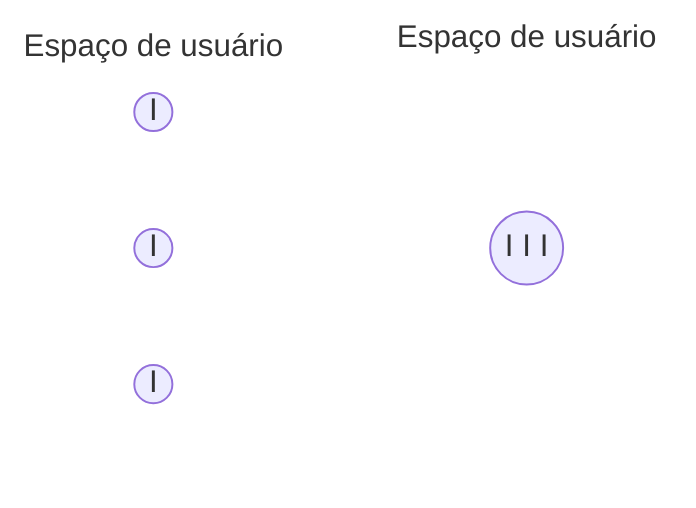
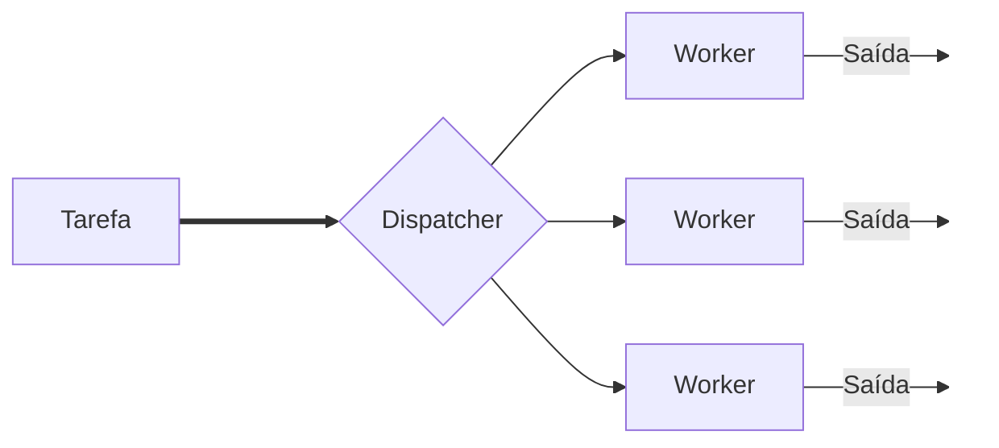
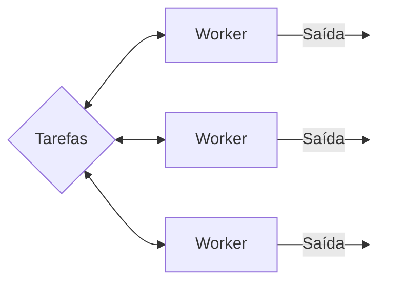
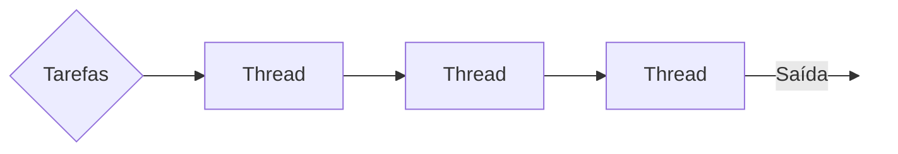

# 5. Threads

O conceito de threads é fundamental para compreender a multiprogramação. No começo, sistemas operacionais suportavama apenas processos de thread única (**monothread**). Posteriormente foi introduzido o conceito de um processo com múltiplas threads (**multithread**), o que possibilitou a implementação eficiente de aplicações concorrentes, pois um processo pode ter várias partes diferentes do seu código sendo executados concorrentemente. 

## 5.1 O que são threads?
Threads ou **linhas de execução**, podem ser definidas como um fluxo de controle individual dentro de um processo, ou seja, são partes de um processo. Cada processo tem ao menos uma thread, que é o fluxo principal de execução, mas pode criar várias threads adicionais para executar tarefas em paralelo. Todas as threads de um processo compartilham o mesmo [espaço de endereçamento](../notes/03_processos_e_threads.md#323-espaço-de-endereçamento), o que torna a comunicação entre elas muito mais simples, consequentemente, melhorando o desempenho da aplicação.

A [troca de contexto](../notes/04_gerencia_do_processador.md#troca-contexto), entre processos tradicionais é muito pesada para o sistema, já que eles não compartilham memória. As threads separam os conceitos de recursos e execução. Processos agrupam recursos e as threads são escalonadas para a execução. Permitem que múltiplas execuções ocorram no mesmo ambiente do processo com um grau de independência entre elas.

- Três processos com uma thread vs. um processo com três threads

<center>

</center>

## 5.2 Comparação: Processos vs. Threads

| Característica          | Processo                     | Thread                                                  |
| ----------------------- | ---------------------------- | ------------------------------------------------------- |
| Espaço de Endereçamento | Isolado, próprio             | Compartilhado com o processo                            |
| Custo de Criação        | Alto                         | Baixo                                                   |
| Troca de Contexto       | Lenta e custosa              | Rápida e barata                                         |
| Comunicação             | IPC (overhead significativo) | Acesso direto (necessita sincronização)                 |
| Recursos                | Próprios                     | Compartilhados com o processo                           |
| Isolamento              | Maior isolamento (proteção)  | Menor isolamento (mais risco de erros de sincronização) |

## 5.3 Ambiente monothread

Um programa é uma sequência de comandos a serem executados pelo SO. Em um ambiente monothread, um processo suporta um único programa em memória, assim, a concorrência é implementada apenas por múltiplos [processos independentes ou subprocessos](../notes/03_processos_e_threads.md#36-processos-independentes-subprocessos-e-threads). Com uso de múltiplos processos cada funcionalidade do software implica na criação de um novo processo para atendê-la, o que consome tempo de processamento para alocação e, posteriormente, desalocação de recursos. Outra dificuldade é a comunuicação entre esses processos que é difícil e lenta, já que envolve mecanismos como pipes, semáforos, troca de mensagens, entre outros. Devido ao não compartilhamento do espaço de endereçamento.

## 5.4 Ambiente multithread

Neste modelo, a entidade **"processo"** é dividida em processo e thread, sendo o processo correspondente ao ambiente (memória e recursos) e a thread corresponde ao estado de execução. Essas duas entidades são armazenados na [tabela de processos](../notes/03_processos_e_threads.md#35-bloco-de-controle-de-processos-pcb), representando as respectivas informações. Cada thread possui seu [contexto de hardware](../notes/03_processos_e_threads.md#32-estrutura-de-um-processo) e compartilham o [espaço de endereçamento e o contexto de software](../notes/03_processos_e_threads.md#32-estrutura-de-um-processo). O [escalonamento](../notes/04_gerencia_do_processador.md) acontece da mesma maneira que com processos tradicionais, porém **a troca de contexto é mais leve**. Threads distintos em um processo não são não independentes quanto processos distintos. Elas também passam pelo mesmos [estados](../notes/03_processos_e_threads.md#33-estados-de-um-processo) que os processos tradicionais.

Como threads compartilham o mesmo espaço de endereçamento, uma thread pode alterar complementamente os dados de outra. Não existe qualquer proteção em relação à isso, isto é de responsabilidade do programador. Para que isso seja funcional, é necessário implementar a comunicação e a sincronização entre elas.

!!! success "Benefícios do multithreading"
    - Desempenho: Utilizar as threads pode aumentar significativamente o desempenho de aplicações, principalmente em CPUs multinúcleo.
    - Responsividade: Podem manter as responsividade em aplicações interativas, como interfaces gráficas, por exemplo.
    - Eficiência: Diminuição do uso de recursos e tempo comparado aos processos comuns.

!!! warning "Desafios do multithreading"
    - Sincronização: Devido ao compartilhamento do espaço de endereçamento, mecanismos de [sincronização](../notes/06_sincronizacao_e_comunicacao.md) como [mutexes]() e [semáforos]() se fazem necessários.
    - Complexidade: Programar em ambientes multithread pode ser um tanto mais complexo se comparado a ambientes monothread.
    - Depuração: Encontrar e corrigir bugs em programas multithreading pode ser desafiador, problemas como [condições de corrida](../notes/05_thread.md#56-condicao-de-corrida) e [deadlocks]() são difíceis de se identificar e corrigir.

## 5.5 Programação multithreading

<div style="display: flex; justify-content: space-between;">

    <div style="width: 48%;">

        ```c title="Exemplo de código sequencial:" hl_lines="14 15"
        #include <stdio.h>

        void func1(){
            printf("Hello ");
            return;
        }

        void func2(){
            printf("World\n");
            return;
        }

        int main() {
            func1();
            func2();
            return 0;
        }
        ```

    </div>

    <div style="width: 48%;">

        ```c title="Exemplo de código multithreading:" hl_lines="14 15"
        #include <stdio.h>

        void func1(){
            printf("Hello ");
            return;
        }

        void func2(){
            printf("World\n");
            return;
        }

        int main() {
           thread_create(func1);
           thread_create(func2);
           thread_exit(0);
        }
        ```
    </div>

</div>  

**No primeiro código eu tenho certeza de que **"`Hello`"** será impresso antes de **"`World`"** ?** 

- Sim, o código é sequencial, ou seja, a ordem de execução (fluxo de controle) do código é único. Portanto, eu posso garantir que "`Hello World\n`" será impresso na ordem correta.

**E no segundo código, posso ter a mesma certeza?**

- Não, pois a execução de threads acontece de maneira concorrente, ou seja, a ordem de execução não é determinada pelo código, mas sim pelo sistema operacional. Por isso, não é possível garantir se será impresso "`Hello World\n`" ou "`World\nHello `", a ordem de execução pode ser intercalada de várias maneiras, podendo até gerar algo da forma: `HeWolrllod\n`.

### 5.5.1 Implementação de threads

Pthreads, ou POSIX Threads, é uma especificação padrão para programação multi-thread em sistemas operacionais que seguem a especificação POSIX (Portable Operating System Interface). Essa API (Application Programming Interface) define um conjunto de funções para criar e gerenciar threads, permitindo que os programadores desenvolvam aplicações concorrentes e paralelas de maneira portátil.

A implementação de threads pode variar bastante dependendo do sistema operacional e da linguagem de programação utilizada. Existem três principais abordagens para a implementação de threads: Threads no nível do usuário, threads no nível do kernel e uma abordagem híbrida.

#### 5.5.1.1 Threads em modo usuário

Em nível de usuário as threads são gerenciadas por uma biblioteca que contém as funções necessárias para criação/eliminação de threads, troca de mensagens entre elas e o escalonamento. O SO não sabe da existência das múltiplas threads nesse contexto, sendo responsabilidade da aplicação. Cada processo precisa da sua própria tabela de threads e geralmente o [escalanador é não-preemptivo](../notes/04_gerencia_do_processador.md#411-escalonadores-preemptivos-e-nao-preemptivos).

!!! success "Vantagens:"

    - Desempenho: A criação e a troca de contexto entre threads são rápidas, pois não requerem chamadas ao sistema.
    - Portabilidade: Como são gerenciadas no espaço do usuário, a implementação pode ser mais facilmente portável entre diferentes sistemas operacionais.

!!! failure "Desvantagens:"

    - Multiprocessamento limitado: Como o kernel não está ciente das threads de nível de usuário, ele vê apenas um único processo. Isso significa que as threads não podem ser distribuídas entre múltiplos núcleos de CPU.
    - Bloqueio: Se uma thread de nível de usuário faz uma chamada bloqueante ao sistema, todo o processo pode ser bloqueado, impedindo que outras threads do mesmo processo continuem a execução mesmo que estejam prontas.

#### 5.5.1.2 Threads em modo kernel
O sistema operacional é o responsável direto pela implementação das threads. Por isso, o SO sabe da existência das threads e pode escalona-las individualmente. Com múltiplos processadores várias threads de um mesmo processo podem rodar em paralelo. O maior problema é a constante mudança entre [modo usuário e modo kernel](../notes/02_estrutura_SO.md#22-modos-de-acesso), o que causa perda considerável no desempenho. Existência de uma tabela de threads no kernel, que contém os dados de cada thread. Quando uma thread é bloqueada, o kernel é responsável por escalonar outra thread para rodar, mesmo que seja de outro processo.

!!! success "Vantagens:"
    - Multiprocessamento Real: O kernel pode agendar threads em diferentes núcleos de CPU, permitindo um verdadeiro paralelismo em sistemas multiprocessadores.
    - Desempenho em Chamadas Bloqueantes: Como o kernel conhece todas as threads, ele pode agendar outras threads do mesmo processo enquanto uma thread está bloqueada em uma chamada ao sistema.

!!! failure "Desvantagens:"
    - Perda de desempenho: A criação de threads e a troca de contexto entre threads podem ser mais custosas, pois envolvem chamadas ao sistema.
    - Complexidade: A implementação e o gerenciamento de threads no nível do kernel são mais complexos.

#### 5.5.1.3 Abordagem híbrida

As arquiteturas de modo híbrido buscam combinar as vantagens dos dois tipos. ==Neste tipo, cada processo pode ter várias threads em modo kernel, por usa vez cada uma dessas threads em kernel pode conter várias outras em modo usuário==. 

!!! success "Vantagens:"
    - Equilíbrio: Combina a baixa latência das threads de nível de usuário com a capacidade de multiprocessamento real das threads de nível de kernel.
    - Flexibilidade: Permite um controle mais fino sobre o uso de recursos, ajustando o número de threads de nível de kernel conforme necessário.   

!!! failure "Desvantagens:"
    - Complexidade de Implementação: Implementar um modelo híbrido é mais complexo, pois requer a coordenação entre threads de nível de usuário e de kernel.
    - Gerenciamento de Recursos: O mapeamento entre threads de usuário e threads de kernel deve ser cuidadosamente gerenciado para evitar ineficiências.

### 5.5.2 Modelo de execução de threads

Existem alguns padrões que podem ser seguidos para a solução comum de criação e término de threads. Thread dinâmicas, onde uma thread é criada
para tratar cada requisição. Thread estática: o número de threads é fixo.   

#### 5.5.2.1 Modelo despachante/trabalhador
Um thread despachante é reponsável por receber um trabalho e delega-lo para uma outra thread trabalhadora. A thread trabalhadora executa e sinaliza para a despachante. Como exemplo, um servidor web que recebe várias requisições de vários clientes, se uma requisição inclui uma leitura de disco e a mesma thread for responsável por receber as requisições e executar os trabalhos, pode-se gerar um problema. Especialmente se o equipamento de rede for mais rápido que o disco.

<center>

</center>

!!! success "Vantagens:"
    - Consumo rápido de mensagens.
    - Boa distribuição das requisições.
    - Flexibilidade: podemos facilmente mudar o número de threads.

!!! failure "Desvantagens:"
    - Pouco uso da CPU pela despachante. Se temos 5 threads, 4 trabalhadoras e 1 despachante o aproveitamento da CPU gira em torno de 80%.

#### 5.5.2.2 Modelo time/team
Nesse modelo, as threads são gulosas e autônomas. Elas acessam uma "poll" (urna) de tarefas, obtêm e as executam.

<center>

</center>

!!! success "Vantagens:"
    - Bom consumo de mensagens.
    - Boa distribuição de requisições.
    - Flexibilidade em mudar o número de tarefas.

!!! failure "Desvantagens:"
    - Cuidado na implementação. Em computadores modernos, uma thread inicia o programa e deve ser responsável por criar todas as outras. Após isso, ela deve se tornar uma thread normal do time.

#### 5.5.2.3 Modelo pipeline
Cada thread realiza uma tarefa e passa os dados para a próxima, e para próxima, assim sucessivamente. A saída é produzida pela última thread.

<center>

</center>

!!! failure "Desvantagens:"
    - Perda de trabalho: se uma thread for muito mais lenta que as outras, todo o processamento é desperdiçado.
    - Muitas vezes não e fácil dividir a tarefa em um pipeline.
