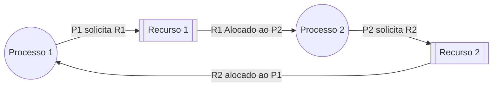

# 7. Deadlocks

O deadlock ou impasse, é uma situação que ocorre, quase sempre, devido ao compartilhamento de recursos entre threads. O problema consiste em um processo aguardar por um recurso que nunca será liberado ou um evento que nunca ocorrerá.

## 7.1 O jantar dos filósofos

O problema do jantar dos filósofos é um problema clássico de sincronização e concorrência de processos formulado por Dijkstra.

- **Descrição**:

Imagine cinco filosófos sentados ao redor de uma mesa circular. Cada filosófo alterna entre os estados *pensar* e *comer*. Cada filósofo possui um prato de espaguete e há um único garfo entre cada par de filósofos (totalizando cinco garfos). Para comer, cada filósofo precisa usar dois garfos (um a esquerda e outro a direita). Depois que um filósofo pensa durante um tempo ele tentará se alimentar.

!!! note "Primeira Solução"

    ```C 
    void philosopher(int i)
    {
        while (true)
        {
            int left = i;
            int right = (i + 1) % 5;

            think();
            take_fork(left);
            take_fork(right);
            eat();
            put_fork(left);
            put_fork(right);
        }
    }
    ```
- **Problema**:

Para um filósofo comer, ele precisa de dois garfos (um de cada lado). No entanto, se todos os filósofos tentarem pegar o garfo à sua direita ao mesmo tempo, nenhum deles conseguirá pegar o segundo garfo (à sua esquerda), resultando em um deadlock. Se o todos os filósofos resolverem pegar o garfo ao mesmo tempo, e ao obter um garfo, o escalonador troca de contexto para outro filósofo. Neste caso, todos os filósofos obterão um garfo e ficarão bloqueados tentando obter o outro. (deadlock)


- **Objetivos**:

    1. Evitar deadlocks: Nenhum filósofo deve ficar impedido de comer porque não consegue obter os dois garfos
    2. Evitar fome: Cada filósofo deve comer eventualmente.
    3. Maximização de desempenho: OS filósofos devem passar o máximo de tempo *comendo* e *pensando*, minimizando o tempo de espera.


### 7.1.1 Possíveis soluções

1. **Podemos permitir que um filósofo largue o garfo esquerdo se não conseguir o direito**: Dessa forma o problema é minimizado mas não resolvido.
1. **Se um filósofo fracassar em obter o outro garfo ele espera um tempo aleatório até tentar novamente**: Na prática isto funciona muito bem, mas não é a melhor solução teórica.
1. **Solução usando [Mutex](../notes/06_sincronizacao_e_comunicacao.md#6432-mutex)**: Esta solução funciona está correta, porém possui um problema de desempenho, visto que os filósofos pensam em paralelo, mas apenas um pode comer por vez. Sabe-se que mais de um filósofo pode comer por vez.


### 7.1.2 Soluções completas

1. Usando [semáforos](./06_sincronizacao_e_comunicacao.md#6431-semaforo): Duas funções uma para pegar e outra para soltar os garfos, elas são protegidas por um outro semáforo binário (mutex). Existe um array com um semáforo por filósofo. O semáforo aumenta se o filósofo conseguir o garfo, ou bloqueia e aguarda que um vizinho libere o garfo necessário.

    ??? abstract "Código"

        ```C linenums="1" hl_lines="18 28 35 36"
        #define N 5
        #define LEFT (i + N - 1) % N
        #define RIGHT (i + 1) % N
        #define THINKING 0 
        #define HUNGRY 1
        #define EATING 2
        #define semaphore int

        int state[N];
        semaphore mutex = 1;
        semaphore s[N];

        void test(int i)
        {
            if (state[i] == HUNGRY && state[LEFT] != EATING && state[RIGHT] != EATING)
            {
                state[i] == EATING;
                up(&s[i]);
            }
        }

        void take_forks(int i)
        {
            down(&mutex);
            state[i] = HUNGRY;
            test(i);
            up(&mutex);
            down(&s[i]);
        }

        void put_forks(int i)
        {
            down(&mutex);
        state[i] = THINKING;
        test(LEFT);
        test(RIGHT);
        up(&mutex);
        }

        void philosopher(int i)
        {
            while(true)
            {
                think();
                take_forks(i);
                eat();
                put_forks(i);
            }
        }
        ```

        > Linha 18: Se os recursos estão livres up no semáforo do processo[i].

        > Linha 28: Se os garfos estão indisponíveis o processo de bloqueia nesse ponto.

        > Linha 35 e 36: Ao liberar os garfos também libera os processos que estão aguardando.


- Permitir que apenas quatro filósofos sentem-se à mesa.
- Permitir que um filósofo pegue o garfo da esquerda apenas se o garfo da direita estiver livre (operação de verificar e pegar precisa ser **atômica**).
- Permitir que um filósofo ímpar pegue o garfo da esquerda primeiro e depois o da direita, enquanto um filósofo par fará o contrário (direita depois esquerda).
- Adicionar mais um garfo.

## 7.2 Condições de deadlock
Como vimos no problema dos filósofos, ao implementar mecanismos de proteeção à seção crítica ([exclusão mútua](./06_sincronizacao_e_comunicacao.md#63-exclusão-mutua)), podemos gerar outro problemas como os **Deadlocks** e a **Inanição**. Podemos resumir o problema dos filósofos da seguinte forma:

<center>


Fonte: Machado e Maia.

</center>

Para que ocorra um deadlock, é necessário que quatro condições ocorram de forma simultânea.

1. [Exclusão Mútua](./06_sincronizacao_e_comunicacao.md#63-exclusão-mutua): Cada recurso só pode estar disponível para um processo por instante.
2. **Posse e espera**: Um processo estar esperando por um recurso que está em posse de outro, enquanto mantém pelo menos um outro recurso.
3. **Não-preempção**: Os recursos não podem ser retirados à força de um processo.
4. **Espera circular**: Um conjunto de dois ou mais processos que aguardam um recurso alocado pelo próximo no conjunto.

Todas essas condições devem ser verdadeiras simultaneamente. Se uma ou mais dessas condições não forem atendidas, um deadlock não pode ocorrer. Portanto, para prevenir ou evitar deadlocks, é necessário quebrar pelo menos uma dessas condições. Isso pode ser feito através de técnicas de prevenção de deadlock, como alocação segura de recursos, detecção de deadlock e recuperação, e evitando a criação de situações onde essas condições possam ocorrer.

!!! quote "O que o SO pode fazer em situações de deadlock?"
    - **Ignorar o problema**: ^^"Algoritmo do Avestruz"^^. Não vale a pena diminuir a performance do sistema para tratar uma situação que ocorre em condições tão específicas e com pouca frequência. {++A maioria dos sistemas modernos adota esta abordagem++}.
    - **Detectar e recuperar o deadlock**: Essa técnica é divida em duas etapas, a **^^detecção e a recuperação^^**, existem algumas técnicas para isso.
    - **Evitar o deadlock**: Os algoritmos de evitação são baseados em **^^estados seguros^^**. Um estado seguro é uma ordem de escalonamento onde todos os processos podem ser concluídos mesmo que solicitem o número máximo de recursos possível.
    - **Prevenir o deadlock**: Esta técnica se baseia em **^^atacar uma das 4 condições de deadlock^^**. Apesar de parecer uma boa ideia, a prevenção de deadlocks é muito limitada, por isso não é aplicada na prática.