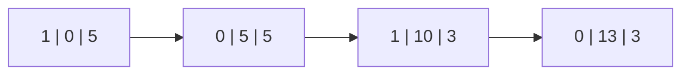
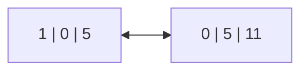

# 8. Mémoria

A gerência de memória é uma atividade crítica de sistemas [multiprogramáveis](./01_conceitos_basicos.md#122-sistemas-multiprogramaveis). A memória principal (RAM) é um recurso caro e escasso. Assim, o foco da gerência de memória em SOs modernos é a memória RAM e não a memória secundária (Discos, HDs, SSDs).

## 8.1 Funções básicas

Em geral, os programas são armazenados na memória secundária, por isso, como o processador só consegue interagir com a memória principal, o SO deve sempre mover um programa da memória secundária para a memória principal, antes de ser executado. Contudo, o tempo de acesso a memória secundária é muito superior em comparação ao acesso a memória principal. Por isso, o número de acessos deve ser reduzido ao máximo. A gerẽncia de memória deve manter o maior número de processos na memória principal, para maximizar o compartilhamento de recursos computacionais. Outra função da gerência de memória é permitir a execução de programas maiores do que o espaço físico realmente disponível, através de algumas técnicas como [overlay](./08_memoria.md#86-overlay) e [memória virtual](). Além disso, a memória alocada para um processo deve ser protegida de outros processos em execução.  

!!! notes "Em resumo:"
    A principal função de um gerente de memória é decidir qual o melhor esquema a ser usado e implementá-lo de maneira eficiente.

## 8.2 Esquemas de gerenciamento de memória

### 8.2.1. Alocação contígua simples

A alocação contígua simples foi uma das primeiras formas de gerenciamento de memória. Nesse modelo, a memória é subdividida em duas partes: Uma parte para o SO e a outra para os processos do usuário. Dessa forma, a única preocupação do programador seria não ultrapassar a área disponível. Nesse tipo de sistema, o usuário têm acesso a toda região de memória, o que pode ser perigoso. O acesso a memória pode ser controlado por meio de um registrador que armazenará a aŕea de memória do SO, e caso um programa tente acessar essa região ele é cancelado.

!!! success "Vantagens"
    - Fácil implementação
    - Código reduzido
    - Não são necessária mudanças de hardware

!!! failure "Desvantagens"
    - Não permite a utilização eficiente dos recursos computacionais
    - Apenas um usuário pode dispor desses recursos

### 8.2.2 Alocação particionada estática

Em contrapartida a técnica anterior, surgiu um modelo que permite a execução de múltiplos programas, a **alocação particionada**. Uma região de memória (protegida por hardware) é alocada para o SO, e os processos dividem o espaço do usuário. Nos primeiros sistemas a memória era dividida em partes de tamanho fixo, denominados **partições**. Alterar o tamanho das partições exigia o reinicio do sistema. Um programa poderia ser carregado apenas para uma partição específica, mesmo que outras estivessem disponíveis (isso devido aos endereços de memória absolutos que eram usados anteriormente).

!!! success "Vantagens"
    - Multiprogramação
    - Simplicidade de implementação
    - Previsibilidade
    

!!! failure "Desvantagens"
    - Desperdício de memória, um processo quase sempre será menor que o espaço disponível na partição (**fragmentação interna**)
    - Falta de flexibilidade

### 8.2.3 Alocação particionada dinâmica

!!! notes "Registradores Base e Limite"
    Os registradores **base** e **limite** são dois registradores especiais que foram equipados na CPU, eles servem como uma técnica de hardware para implementar a proteção de memória em SOs. Nessa técnica, os programas são sempre carregados de maneira consecutiva. O registrador base armazena a posição de ínicio do programa, e o limite o comprimento dele. Toda vez que um endereço de memória é referenciado no programa, automaticamente, é adicionado o valor **base** a ele. Da mesma forma, é verificado se esse valor extrapola o **limite**. Uma desvantagem desse processo é que para cada referência de memória, duas operações, soma e comparação, são adicionadas ao programa.

O uso de registradores base e limite permite um novo esquema de partições de tamanho variável, a **alocação particionada dinâmica**. Nesse tipo de alocação, o conceito de partições de tamanho fixo foi eliminado. Os processos utilizariam o espaço que fosse necessário, resolvendo o problema de **fragmentação interna**. Porém, outro problema surgiu nesse modelo. Conforme os programas fossem terminando, "buracos" seriam deixados na memória, não permitindo que outros programas fossem alocados, por mais que o espaço total fosse suficiente. Esse problema é conhecido como **fragmentação externa**.

Soluções para o problema da fragmentação externa:

  1. **Agrupamento de áreas adjacentes**: As áreas de memória que estão livres são agrupadas em áreas maiores de memória.
  2. **Compactação de memória**: Consiste em mover os processos existentes, eliminando o espaço livre entre elas e formando um único bloco contíguo de memória. É uma estratégia muito boa, porém pode ser muito custosa.

!!! success "Vantagens"
    - Eficiência de uso da memória
    - Flexibilidade
    - Adaptação dinâmica

!!! failure "Desvantagens"
    - Complexidade de implementação
    - Overhead de gerenciamento
    - **Fragmentação Externa**

## 8.3 Algoritmos de alocação de memória  

Existem três estratégias base para determinar a forma de alocação de processos na memória.

### 8.3.1 First Fit (primeiro encaixe)

Nesta estratégia, o gerenciador de memória procura o primeira espaço livre que tenha tamanho suficiente para alocar o processo. O espaço livre será então dividido em duas partes, o espaço do processo e o espaço em branco que ficará excedente (assumindo que não ocorra um improvável encaixe perfeito).

### 8.3.2 Best Fit (melhor encaixe)

Este algoritmo percorre **toda a lista** de partições, em busca daquele espaço que seja mais adequado ao processo, ao invés de usar um espaço grande demais. O objetivo desta estratégia é diminuir a fragmentação na esperança de encontrar um espaço ótimo. Porém, o que acontece na prática é a criação de espaços muito pequenos, inúteis, na memória.

### 8.3.3 Worst Fit (pior encaixe)

Para contornar a situação ocorrida no best fit, o **worst fit** faz o exato contrário do algoritmo anterior. Nesta estratégia, toda a lista é percorrida em busca da maior possível, para alocar o processo em questão. Por isso, a tendência é deixar espaços maiores em memória, o que permite que um maior número de processos possa ser encaixado naquela região.

!!! info "Qual a melhor estratégia?"
    Apesar de ser a menos requintada e de implementação mais simples, o tempo e a prática mostraram que o algoritmo **First Fit** tende a ser o melhor tanto em tempo de execução (não precisa percorrer toda a lista), mas também em consumo de recursos.

## 8.4 Gerenciamento de espaço livre

Quando o processo possui um tamanho fixo, um espaço exatamento igual ao tamanho do processo deve ser alocada. No entanto, a maioria dos sistemas permitem que o tamanho do processo mude e cresça no decorrer da execução. Para isso é preciso reservar um espaçao maior que o original do processo.

### 8.4.1 Mapa de bits

A memória é dividida em unidades de alocação, geralmente de **1 byte**. Cada unidade corresponde a **1 bit** do mapa, sendo **0 corresponde a livre** e **1 corresponde a ocupada**. Vale ressaltar que o espaço da unidade de alocação também pode ser modificado (2 bytes por exemplo), isso resulta em mapa de bits menor porém em um maior desperdício de memória. O mapa de bits é uma maneira simples de controlar o espaço em memória, porém a busca por espaços vazios é muito lenta, o que torna seu uso prático inviável.

### 8.4.2 Lista encadeada

Nesta outra estratégia cada espaço é representado por uma estrutura que armazena: seu status (livre ou ocupado/0 ou 1), o endereço de início, o tamanho do segmento, um ponteiro para o próximo elemento.

A lista possui a vantagem de ser muito boa para atualizar espaços livres, ao liberar um espaço basta unir aos vizinhos que também estão livres, por isso uma variação comum é o uso da lista duplamente encadeada.

> A terceira partição foi liberada:

## 8.5 Swapping

Muitas vezes ocorre de um programa não poder ser executado devido a falta de espaço livre em memória. No entanto, existem diversos processos que ocupam espaço na memória principal porém não são utilizados (daemons). A técnica de **swapping** foi introudizada para contornar este problema. O swapping é uma atividade aplicada juntamente a gerência de memória e escolhe programas que estão esperando por **espaço livre** para serem executados. 

Em todos os esquemas anteriores, o processo permanecia na memória principal até que sua execução terminasse por completo, inclusive aqueles que estavam em [estado bloqueado](./03_processos_e_threads.md#332-bloqueado-wait), esperando por algum evento, operação de I/O por exemplo. Nesta situação, o SO escolhe um processo residente na memória principal e o trasnfere para a memória secundária (swap out). Posteriormente, se o processo for despertado ou for escolhido pelo [escalonador](./04_gerencia_do_processador.md#41-escalonador-e-criterios-de-escalonamento) ele é transferido novamente para a memória principal (swap in) e pode continuar sua execução normalmente. Para isso, existe uma área especialmente reservada no disco (área de swap).

O algoritmo de escolha do processo deve priorizar aqueles que têm baixa chance de serem escalonados, para evitar swapping desnecessário, visto que é uma operação cara. Para que seja implementado com eficiência, registradores base e limite são necessários, pois ao voltar para a memória principal, o programa pode estar em uma região diferente de memória, o que exige a modificação de todas as instruções de leitura dele. O swapping permite um maior compartilhamento de memória e maior uso dos recursos computacionais, contudo, nem tudo são flores, as operações de **swap in** e **swap out** são de elevado custo. Em situações onde a memória está muito ocupado, o sistema pode ficar quase que inteiramente dedicado a essa tarefa, esta situação é chamada de ***thrashing*** e é considerada um **problema crítico** da gerência de memória

## 8.6 Overlay

Outra técnica possível é o **Overlay**. Nele, o programador divide o programa em módulos, e informa quais são dependentes e devem estar ativos de forma simultânea. Dessa forma, o SO não necessita carregar o programa por inteiro em memória e, apenas, os módulos necessários. 