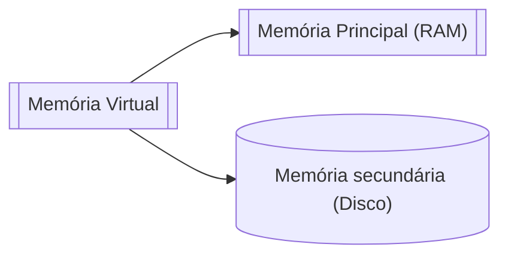

# 9. Memória virtual

## 9.1 Introdução

Em [Memória](./08_memoria.md), vimos que o uso de **partições de tamanho variável** era mais eficiente e flexível, porém o problema da [fragmentação externa](./08_memoria.md#823-alocacao-particionada-dinamica) era constante e poderia precisar até de intervenção do SO. 

Uma forma de minimizar esse problema seria o uso da memória virtual, implementado na grande maioria dos sistemas operacionais modernos. É uma técnica semelhante ao [Overlay](./08_memoria.md#86-overlay), porém não seria implementada pelo programador e sim pelo SO. A memória virtual é uma técnica sofisticada e muito poderosa, onde as memórias principal e secundária são combinadas, afim de dar a ilusão de que existe uma memória muito maior do que o real espaço da memória principal. 

Processos não referenciam mais endereços físicos da memória e sim **endereços virtuais** que vão além do espaço da memória principal. Ela permite um número maior de processos residentes, já que apenas partes deles são de fato carregados, isso leva a um melhor uso da CPU, além de minimizar o problema de fragmentação.

## 9.2 Implementação

A memória virtual foi implementada primeiro no sistema operacional Atlas, desenvolvido na Universidade de Manchester em 1962. Muitas modificações necessárias para implement-la são feitas **diretamente no hardware**, por isso os SOs devem levar em conta a arquitetura do computador, especialmente o esquema de endereçamento do processador.

## 9.3 Endereçamento Virtual

Um endereçamento virtual pode ser comparado ao acesso a um vetor na memória, o programador não precisa se preocupar com qual endereço ele está acessando, está é uma tarefa do compilador. A abstração para a memória virtual é bastante semelhante, os programas não fazem referência para os endereços físicos (endereço real na memória), mas sim para um endereço virtual. Esse endereço virtual será posteriormente substituído pelo real valor, no momento da execução, já que o processador pode lidar somente com endereços reais na memória. Esta mudança de virtual para real é denominada **mapeamento**.

Como o espaço virtual não possui relação alguma com o espaço real, os processos podem referenciar um endereço que está fora do limite da memória principal. Isso somente é possível porque o sistema combina a memória secundária à memória principal. Quando um programa é executado somente uma parte dele fica residente, permanecendo o restante na memória secundária até que seja o momento de ser referenciado. 

No desenvolvimento de aplicações, o programador não precisa se preocupar com endereços virtuais, apenas informa o tamanho de memória necessário. Durante a **compilação** e a **montagem**, endereços virtuais são colocados no código executável. Esses que serão usados pelo SO para mapear endereços reais durante a execução.

## 9.4 Mapeamento

Um endereço virtual não pode ser acessado pelo processador, por isso há a necessidade de traduzi-los para endereços reais. Essa tarefa é realizada juntamente pelo SO e pelo hardware. A unidade física que é responsável pelo mapeamento é chamado unidade de gerência de memória (MMU), sendo acionado toda vez que uma referência a espaço virtual ocorre.

Cada processo possui seu próprio espaço de endereçamento virtual, como se possuísse sua própria memória, e sua própria tabela de mapeamento que relaciona os endereços virtuais aos reais. Esta tabela é alterada a cada troca de contexto. Um registrador da CPU aponta para a entrada da tabela corrente.

Vale dizer que, cada célula da memória não corresponde a uma única entrada (linha) da tabela, caso contrário ela seria imensa, mas corresponde a um **bloco** de memória no mapeamento, e não células individuais.

| Espaço virtual | Tamanho do bloco | Número de entradas da tabela |
| -------------- | :--------------: | ---------------------------: |
| 2³²            |  512 endereços   |                          2²³ |
| 2³² endereços  |   4K endereços   |                          2²⁰ |
| 2⁶⁴ endereços  |   4K endereços   |                          2⁵² |
| 2⁶⁴ endereços  |  64K endereços   |                          2⁴⁸ |

!!! info "Vantagens deste modelo de mapeamento"
    As principais vantagens deste tipo de mapeamento são duas:
        
    1. Pode-se usar memória secundária e memória
    primária para criar uma memória maior que a
    disponível.
    2. E algo muito importante: os processos não
    precisam necessariamente serem alocados em
    memória contínua. 

## 9.5 Memória virtual por paginação

Uma forma de dividir o endereçamento virtual e real é por meio da **paginação**. Esta técnica divide a memória em partes iguais de **tamanho fixo**, páginas. Páginas no espaço virtual são páginas virtuais e páginas no espaço real são páginas reais ou frames. A CPU envia o endereço virtual (v) para a MMU, onde o endereço virtual é dividido em (p, d), página e deslocamento. A MMU utiliza p para acessar o frame f na qual a página p reside, ela substitui p por f e adiciona (f, d) ao barramento.

Sempre que um endereço virtual é referenciado e ele não está na memória principal é gerado um **page fault**. Neste caso, o sistema realiza uma transferência de página da memória secundária para a principal, conhecido como **page in**. O sistema irá escolher uma outra página para ir a memória secundária e executará a instrução que causou a excessão novamente. Quando isso ocorre, o processo vai para estado de bloqueado até que a operação de paginação (operação de I/O) termine. O processo contrário, mover uma página da memória RAM para o disco, é conhecido como **page out**.

### 9.5.1 Busca de páginas

Existem duas maneiras de buscar páginas na memória:

**1. Paginação por demanda**: Uma página somente é movida quando requisitada.

**2. Paginação antecipada**: Ao mover uma página o sistema já busca antecipar possíveis futuras requisições, movendo páginas próximas.

### 9.5.2 Alocação de páginas

A política de alocação de páginas determina quantos frames cada processo pode ter na memória principal.

**1. Alocação fixa**: Cada processo tem um número máximo de frames que pode ocupar durante a execução. Caso atinja o limite um **page fault** é forçado. É justo, porém não prático, as aplicações têm requisitos de memória muito diferenciado. Se o número de frames for pequeno para aquela aplicação muitos page faults são forçados mesmo tendo espaço disponível. Se o número for muito grande, cada processo ocupa muito espaço diminuindo o número de processos residentes.

**2. Alocação variável**: O número de frames que cada processo pode ocupar varia durante a execução de acordo com a taxa de paginação (número de page faults) e com o espaço disponível. Processos com alta taxa de paginação podem aumentar o limite de frames e processos com baixa taxa liberam seus frames excedentes para outros processos.

### 9.5.3 Substituição de páginas

Quando substituições de páginas são necessárias o sistema realiza as trocas e coloca as movimentações de **page in** e **page out** em um arquivo chamado **arquivo de paginação**. Nem todas as páginas precisam ser copiadas para o arquivo (páginas que não serão mais usadas, por exemplo). Já páginas que são modificáveis, ou seja, sofrem alteração durante a execução são marcadas por um **bit de modificação**.

A substituição de páginas pode ser classificada quanto ao escopo, ou seja, dentre os processos residentes quais são os candidatos a terem páginas realocadas:

1. Substituição local: Apenas as páginas do processo que gerou o page fault são candidatas a realocação.
2. Substituição global: Todas as páginas de todos os processos residentes são candidatas a realocação, na verdade nem todas, algumas páginas como a do núcleo do sistema são marcadas como bloqueadas e não podem ser trocadas. 

## 9.6 Working set

Um desafio de implementar a memória virtual é a decisão de quais páginas devem se mater e quais devem sair. Como já se sabe, caso o número de páginas for muito pequeno podem ocorrer inúmeras operações de paginação, ocupado o processador quase que na totalidade, o já conhecido *thrashing*. Mas, na mesma medida, o sistema deve manter o número mínimo de páginas por processo, para maximizar o compartilhamento de memória.

O **working set** surgiu na intenção de diminuir a ocorrência de *thrashing*. Este mecanismo funciona com base no **princípio da localidade**. Existem dois tipos de localidade observados:

1. Localidade espacial: É a tendência de após uma referência a um determinado endereço, sejam realizadas referências a endereços próximos.
2. Localidade temporal: É a tendência de após uma referência a um endereço, ele seja novamente referenciado em um curto espaço de tempo.

Em suma, o processador tende a permanecer focado em um conjunto de páginas por um determinado período de tempo. Imagine um laço de repetição que ocupe 3 páginas. A tendência de essas 3 páginas serem referenciadas diversas vezes seguidas é muito alta.

No começo da execução de um programa o número de page faults é muito elevado, pois nenhum frame está carregado em memória. Ao decorrer da execução este número diminui e depois volta a aumentar, porque o programa entrou em uma nova "fase", que nada mais é que um subconjunto de páginas.

Dentro de um working set, o **número de páginas referenciadas** é conhecido como o **tamanho do working set**. Isso ajuda a calcular quais são as páginas necessárias para a execução do programa. Este modelo deve ser implementado em um ambiente com **alocação de páginas variável**, para que o SO possa ajustar o número de páginas de acordo com o tamanho do working set de cada processo. Mas, ainda esse não é o maior problema da gerência de memória virtual, e sim decidir quais páginas retirar da memória.

## 9.7 Algoritmos de substituição de páginas

A partir do princípio da localidade podem ser selecionadas algumas páginas para remoção. O algoritmo deve ser rápido para diminuir o overhead do sistema. O principal objetivo dos algoritmos é tentar prever o comportamento dos programas e escolher aquelas páginas com menor chance de serem referenciadas em um futuro próximo.

### 9.7.1 Ótimo

Este algoritmo seleciona as páginas que não serão mais usadas no futuro ou aquela com maior tempo até uma nova referência. É um algoritmo usado apenas como ideal, pois na prática **é impossível de ser implementado**.

### 9.7.2 Aleatório

O algoritmo seleciona aleatoriamente as páginas a serem substituídas. Como o futuro é indeterminado, ele visa diminuir ao máximo o overhead do sistema de selecionar uma página. Na prática **não é muito eficiente**.

### 9.7.3 FIFO (First-In-First-Out)

Seleciona a página que está a mais tempo residente, mantendo as mais novas. Implementado usando fila. Contudo, considera apenas a criação da página e não os acessos, uma página recém acessada pode ser removida, **violando o princípio da localidade temporal**.

### 9.7.4 LFU (Least-Frequently-Used)

Seleciona a página menos utilizada, com isso, cria-se um overhead de manter um contador de acessos para cada página. Aparenta ser uma boa estratégia, **porém é injusto**, novas páginas com contadores baixos serão frequentemente removidas enquanto páginas antigas com altos contadores nunca serão.

### 9.7.5 LRU (Least-Recently-Used)

O algoritmo seleciona páginas que estão a mais tempo sem acesso. Leva em conta o princípio da localidade. O tempo de acesso precisa ser guardado para cada frame, e pode ser implementado por meio de uma lista encadeada ou fila de prioridades. Possui **alto custo de implementação**.

### 9.7.6 NRU (Not-Recently-Used)

É um simplificação do algoritmo anterior, ao invés de existir um contador para cada processo há apenas um bit de referência na tabela de paginação. Se uma página foi acessada é marcada com **1**, periodicamente o sistema reseta todas as páginas para **0**, dessa forma, quando as páginas forem marcadas novamente, ele poderá distinguir quais estão sendo acessadas e quais não. **A estratégia possui sucesso quando combinada com bit de modficação**. Priorizará páginas que não foram modificadas nem acessadas. Se não houver nenhuma nessa condição, selecionará aquelas modificas mas não acessadas, preservando o princípio da localidade.

### 9.7.7 FIFO circular (clock)

Algoritmo FIFO que utiliza estrutura circular, similar a um relógio. Usado em muito sistemas Unix. Existe um ponteiro que guarda a posição da página mais antiga e cada página possui um bit de referência. Se o bit r for igual a **0**, indicando que não teve acesso recente, a página removida. Se r igual a **1**, r é marcado com **0** e passa-se para o próximo elemento até encontrar um r igual a 0 ou até dar uma volta completa na lista. Se a volta for completa, a página mais antiga será removida como um FIFO puro. Não há overhead de zerar todos os bits periodicamente.

## 9.8 Tamanho das páginas

Selecionar o tamanho das páginas é um fator importante para a implementação da memória virtual. O tamanho pode ser muito variado. Páginas muito grandes diminuem o tamanho da tabela de paginção mas aumentam a fragmentação interna. Páginas pequenas possuem tabelas maiores mas melhoram a utilização da memória. Outro fator importante é o tempo de leitura na memória secundária, duas páginas de 512B podem demorar muito mais que uma de 1024B. Sistemas modernos optam por páginas de 4KB ou 8KB.

## 9.9 Paginação de múltiplos níveis

Em sistemas que possuem apenas um nível de paginação, o tamanho das tabelas de páginas pode ser um problema. Com vários processos residentes, gerenciar um alto número de tabelas de tamanho grande pode ser um desafio. Para contornar este problemas, tabelas de múltiplos níveis podem ser usadas. A ideia é aplicar o princípio da localidade não somente as páginas em memória, mas também as tabelas de mapeamento. Somente seriam mantidas em memórias as informações sobre páginas realmente relevantes aos processos. Existem tabelas de 1 até 4 níveis, porém um número alto de páginas causa um overhead muito grande.

## 9.10 Proteção de Memória

Em qualquer sistema multiprogramável, a proteção de memória entre aplicações e o sistema operacional é imprescindível. O SO deve proibir que programas alterem páginas do sistema livremente. Até mesmo páginas do próprio processo devem ser protegidas contra ele mesmo, as que contém código executável por exemplo. 

Um primeiro nível de proteção é trazido pelo próprio modelo de paginação. Cada processo possui sua própria tabela de mapeamento que é traduzida pelo sistema. Portanto, a não ser que haja compartilhamento de páginas explícito, um processo não pode acessar páginas de outro. Existem 3 níveis de acesso: Sem acesso, apenas leitura e leitura e gravação. Sempre que uma página for referenciada, o SO verifica se a operação é permitida, caso contrário um erro é gerado. Esta é uma operação bastante complicada.

| LG  | Níveis de acesso |
| --- | ---------------- |
| 00  | Sem acesso       |
| 10  | Leitura          |
| 11  | Leitura/gravação |

## 9.11 Memória virtual por segmentação

Memória virtual por segmentação é uma técnica que divide o espaço de endereçamento virtual em **blocos de tamanho variado**, segmentos. Nesta técnica, o programa é dividido logicamente em subrotinas e estruturas de dados e cada um é alocado em um segmento na memória principal.

A divisão desses segmentos é geralmente feita pelo compilador e cada segmento é uma sequência linear de endereços que pode mudar de tamanho. Limites sobre o tamanho de segmentos e quantidade de segmentos por processo são estabelecidos. A alocação de dos segmentos segue um padrão lógico de acordo com o código-fonte do programa, e os segmentos podem representar funções, variáveis, arrays, etc. 

O mecanismo de mapeamento é muito semelhante ao da paginação, segmentos são mapeados por tabelas de segmentos, endereços são compostos pelo número de segmento virtual (NSV) e o deslocamento. 

Um grande bônus em relação à paginação é a facilidade em lidar com estruturas de dados dinâmicas. Apenas os segmentos referenciados serão transferidos da memória secundária para a principal, por isso, para que funcione de maneira eficiente, o programa deve ser desenvolvido buscando a separação em módulos, caso contrário muitos segmentos estarão em memória desnecessariamente. Para alocar os segmentos o sistema pode utilizar a mesma estratégia da alocação particionada dinâmica [(first-fit, best-fit ou worst-fit)](./08_memoria.md#831-first-fit-primeiro-encaixe).

## 9.12 Paginação vs. Segmentação

Enquanto na paginação há o problema da **fragmentação interna**, aqui há o problema da **fragmentação externa**. A proteção de dados na segmentação é muito mais simples. Cada segmento possui um conteúdo bem definido, portanto alguns bits na tabela de segmentos bastam para definir o nível de acesso. Na paginação áreas de dados e de código estão misturadas, por isso é complexa a proteção. Na segmentação também é mais simples o compartilhamento de dados, basta que as tabelas de segmentos de diversos processos apontem para o mesmo segmento na memória, por exemplo o acesso a um vetor em paginação pode exigir vários acessos a uma página, enquanto na segmentação um único acesso.

| Característica            | Paginação   | Segmentação   |
| ------------------------- | ----------- | ------------- |
| **Tamanho dos blocos**    | Fixo        | Variável      |
| **Proteção**              | Complexa    | Simples       |
| **Compartilhamento**      | Complexo    | Simples       |
| **Estruturas dinâmicas**  | Complexo    | Simples       |
| **Fragmentação**          | Interna     | Externa       |
| **Programação modular**   | Dispensável | Indispensável |
| **Alteração do programa** | Trabalhosa  | Simples       |

## 9.13 Memória virtual por paginação e segmentação

Esta estratégia busca combinar as vantagens dos dois modelos. O espaço de endereçamento virtual é dividido em segmentos e cada segmento em páginas. Para o programador a aplicação continua dividida em segmentos, porém o sistema vê cada segmento como um conjunto de páginas de mesmo tamanho, mapeadas por uma tabela de páginas associadas ao segmento. Assim, um segmento não precisa estar contíguo na memória, **eliminando o problema da fragmentação externa** presente na segmentação pura.

