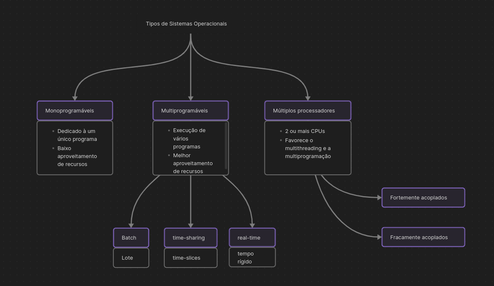

# O que é um Sistema Operacional?

Um Sistema Operacional pode ser definido como um software que atua como um intermediador entre o computador e o usuário. Sem ele, o usuário necessitaria de conhecimento profundo sobre o hardware do equipamento e seu funcionamento, tornando o processo difícil e lento. A principal função de um SO é gerenciar o funcionamento da máquina, controlando a utilização e compartilhamento de recursos como memória, processadores e periféricos. 

Em outras palavras, um Sistema Operacional é um conjunto de rotinas executadas pelo processador. A maior diferença de um SO para uma aplicação comum é a forma com que é executada em função do tempo. Não é um programa executado de forma linear, mas sim de forma concorrente em função de eventos assíncronos na utilização de um computador. 

# Funções básicas dos SOs

## Facilidade de acesso aos recursos do sistema

O sistema operacional apresenta uma **máquina estendida** significativamente mais fácil de programar do que a máquina real.
- **Máquina real**: verificar a rotação do disco, posicionar o cabeçote na trilha correta, realizar a operação de leitura/escrita, etc.
- Máquina estendida: 

```C
fp = fopen(arq);
fread(fp, ...);
```

## Compartilhamento de recursos de forma organizada e protegida

Um computador nada mais é que um conjunto de recursos que serão compartilhados, podem ser:
- Físicos: Processadores, memória, discos, rede...
- Abstratos: Arquivos, processos...

O SO deve proteger esses recursos e controlar o acesso concorrente à eles. Além de que o gerenciamento desses recursos também permite a redução de custos na medida que vários usuários podem utilizar as mesmas facilidades. Como exemplo:
- CPU: Um programa irá utilizar a CPU por determinado tempo, após isso o SO deve intervir e permitir que outro programa execute.
- Memória: Um programa deve terminar se alternar uma região de memória que não lhe pertence.

Além disso, para todo recurso o SO deve: 
- Manter informações sobre o recurso.
- Decidir quem pode acessá-lo.
- Alocar e libera-lo.
É desejável:
- Gerenciar os recursos da maneira mais eficiente possível.
- Possuir um tempo de resposta previsível.

### Sendo assim suas funções podem ser resumidas em:
- Criar **abstrações** para o usuário, no intuito de facilitar o uso (máquina estendida).
- **Gerenciar** os recurso de hardware do dispositivo.

# Tipos de Sistemas Operacionais

Existem 3 principais tipos de Sistemas Operacionais.

## Sistemas Monoprogramáveis
Os sistemas monotarefas, como ficaram conhecidos, permitiam que os recursos do computador ficassem exclusivamente dedicado à um **único** programa. Sendo assim, qualquer outra aplicação a ser executada deveria aguardar o término do concorrente.

Caso o programa estivesse aguardando algum evento, como a entrada de um dado por exemplo, a CPU permaneceria ociosa, gerando um subaproveitamento dos recursos computacionais.

## Sistemas Multiprogramáveis
Nesse tipo de sistema os recursos são compartilhados com vários usuários/aplicações. Enquanto um programa esperar por uma leitura de disco outros programas são executados pela CPU. É papel do Sistema operacional gerenciar o acesso aos recursos. Redução de custos e melhor aproveitamento do computador.

Podem ser subclassificados de acordo com o gerenciamento de suas aplicações:

### Sistemas Batch
Não exige interação do usuário, foram inspirados no uso de cartões perfurados e/ou fitas magnéticas da década de 60. Podem ser bem eficientes dependendo da implementação. Atualmente os sistemas apenas simulam o processamento batch. Aplicações organizadas e processadas em lote.

### Sistemas de tempo compartilhado (time-sharing)
Permitem que diversos programas sejam executados a partir das *time-slices*. Caso o processamento não seja concluído dentro do tempo, ele é interrompido e substituído, continuando na próxima *fatia de tempo*. Mudanças no SO e hardware são necessárias para implementação desse comportamento.

### Sistemas de tempo real (real-time)
São semelhantes ao anterior, a diferença está no tempo exigido para o processamento. Em sistemas *real-time* o limite de tempo deve ser cumprido de maneira **rígida**, caso contrário podem haver **problemas irreparáveis**. Aqui, não existe tempo determinado para o processamento, um programa utiliza o processador o tempo que for necessário, até aparecer outro programa **mais prioritário**. Tal prioridade é definida pela própria aplicação, não pelo SO. Usados para indústrias sensíveis como automobilística ou de tráfego aéreo.

## Sistemas com múltiplos processadores
Caracterizados pela presença de duas ou mais CPUs interligadas e trabalhando em conjunto. Permitem que vários programas executem em paralelo, ou que um programa seja executado em várias partes e, consequentemente, mais rápido (**se for multithreaded**). Também podem ser subclassificados em: **Fortemente acoplados e fracamente acoplados**, a depender do nível de ligação de memória e periféricos.

[Tipos de SOs](assets/SO_tipos.canvas)

